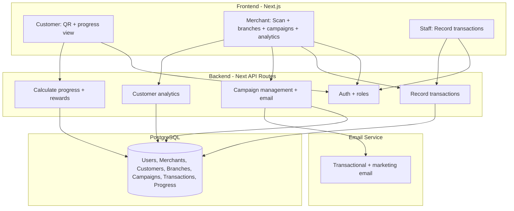

# Loyalty Tracker Web App – Plan

## Architecture Overview




- **User types**: Users can be merchants, customers, or both (separate tables with FK to User).
- **Merchant structure**: Merchants have multiple branches; campaigns can be cloned across branches (many-to-many).
- **Points-based system**: Transactions record spend/quantity/visit; points accumulate per campaign; milestones unlock rewards.
- **Customer flow**: Sign up → get QR → show progress per branch/campaign → redeem eligible rewards.
- **Merchant flow**: Create branches → create campaigns (with promos/milestones) → clone to branches → staff scans QR to record transactions → view customer analytics → send email campaigns.

---

## 1. Tech Stack (Default)


| Layer    | Choice                                      | Notes                                                                                                        |
| -------- | ------------------------------------------- | ------------------------------------------------------------------------------------------------------------ |
| Frontend | Next.js 14+ (App Router), TypeScript        | SSR/SSG for landing; client for app; one codebase for web and future PWA                                     |
| Backend  | Next.js API Routes or separate Node/Express | Prefer Next API routes for simplicity unless you need a separate service                                     |
| Database | PostgreSQL                                  | Hosted (e.g. Supabase, Neon, or self-hosted)                                                                 |
| ORM      | Prisma or Drizzle                           | Migrations, type-safe access to PostgreSQL                                                                   |
| Auth     | NextAuth.js or Clerk                        | Email/password + optional “Sign in with Google”; store role (merchant/customer) on profile or in DB          |
| QR       | `qrcode` (node) / `qrcode.react` (browser)  | Generate QR that encodes a **stamp-redemption URL** or a **customer token** (see below)                      |
| Email    | Resend or SendGrid                          | Transactional (welcome, stamp earned) + marketing (merchant campaigns); design so push/SMS can plug in later |


---

## 2. Data Model (Core)

**Note**: The data model has been updated per your specifications. See **Section 8** below for the complete Prisma schema with all tables, relationships, and enums.

The model includes:

1. **User** table (base authentication)
2. **Merchant** and **Customer** tables (separate, both FK to User)
3. **Branch** table (merchants have multiple branches)
4. **Campaign** table (with start/end dates, promos list, milestones list)
5. **BranchCampaign** junction table (many-to-many: campaigns cloned across branches)
6. **Transaction** table (spend, quantity, visit recorded by staff)
7. **CustomerCampaignProgress** table (current snapshot: points and reward eligibility)
8. **CustomerCampaignProgressHistory** table (audit log: tracks every change)

- **User**: id, email, passwordHash, name, createdAt.
- **Merchant**: id, userId (FK), businessName, slug, logoUrl, createdAt. (One merchant per user for MVP.)
- **LoyaltyProgram** (per merchant): id, merchantId, name (e.g. “Free coffee”), stampsRequired (e.g. 10), optional rewardDescription.
- **StampCard** (per customer per merchant): id, userId, merchantId, loyaltyProgramId, stampsCount, createdAt, updatedAt. Unique on (userId, merchantId) or (userId, loyaltyProgramId).
- **Stamp** (audit log): id, stampCardId, createdAt, optional metadata (e.g. staffId).
- **CustomerProfile** (merchant-facing): denormalized or view over User + StampCard + lastVisit, totalStamps, etc., for listing and segmentation.
- **Campaign**: id, merchantId, name, segment (e.g. “has stamp card”, “visited in last 30 days”), channel (email for now), subject, body, status, scheduledAt, sentAt. Design so channel can later be `push` or `sms`.
- **CampaignRecipient**: campaignId, userId (or email), status (pending/sent/failed), sentAt.

Design the **QR payload** so the merchant app can add a stamp without the customer being present:

- Option A: QR encodes `https://app.com/s/redemptions?token=<customerRedemptionToken>`. Merchant opens this URL (or in-app browser) and the backend validates token, resolves customer, and adds one stamp for that merchant.
- Option B: QR encodes a short code (e.g. `CUST-XXXX`) that the merchant app sends to the API; backend looks up customer and stamp card and adds stamp.

Use a **signed or tamper-proof token** (e.g. JWT or signed payload with expiry) so only your backend can add stamps.

---

## 3. Core Flows

**Customer: Get my QR**

- Customer logs in → “My stamp cards” → for each merchant, show current stamp count and a **QR code**.
- QR generated client-side or via API: encode redemption URL or customer code (see above). Same QR can be reused for every visit to that merchant.

**Merchant: Record a stamp**

- Merchant logs in → “Scan” → camera or file upload to read QR (use `html5-qrcode` or similar).
- App sends token/code to API → backend resolves customer and merchant → increment StampCard.stampsCount, insert Stamp row, optionally check if reward earned and trigger “reward earned” email.

**Merchant: Customer base and email retargeting**

- “Customers” list: list of users who have a StampCard for this merchant (with stampsCount, lastStampAt, etc.).
- Filters/segments: e.g. “has at least 1 stamp”, “visited in last 7/30 days”, “never redeemed a reward”.
- “Campaigns” or “Send email”: create campaign, choose segment, write subject/body, send (or schedule). Use your email provider (Resend/SendGrid); store Campaign + CampaignRecipient for history. Start with **email only**; same Campaign model can later drive push/SMS.

---

## 4. Security and Validation

- Auth: protect all API routes; ensure “current user” is resolved from session/JWT.
- Merchant actions (add stamp, view customers, send campaign): allow only if the authenticated user is a merchant and the resource (e.g. stamp card, campaign) belongs to their merchantId.
- Rate limit stamp-add and campaign-send endpoints to avoid abuse.
- Redemption token: short-lived (e.g. 5–15 min) or one-time-use optional; bind token to userId so it can’t be reused for another customer.

---

## 5. Implementation Phases

**Phase 1 – Foundation**

- Next.js app (TypeScript), PostgreSQL + Prisma (or Drizzle), basic schema: User, Merchant, LoyaltyProgram, StampCard, Stamp.
- Auth (NextAuth or Clerk): sign up, login, attach role and merchantId to session.
- Seed one merchant and one customer for testing.

**Phase 2 – Customer QR and stamp flow**

- Customer UI: “My stamp cards” and QR per merchant (redemption URL or code).
- Merchant UI: “Scan” (camera or upload) → call API with token/code → add stamp and return updated count.
- API: redemption endpoint that validates token, finds StampCard, increments stamps, inserts Stamp, returns new count (and “reward earned” flag if applicable).

**Phase 3 – Merchant dashboard and profiling**

- Merchant dashboard: list customers (from StampCards + User), with stampsCount, lastStampAt, optional “last 7/30 days” column.
- Simple segments: e.g. “has stamp card”, “stamps in last 30 days < 1”.
- Optional: reward redemption flow (mark reward as used, reset or decrement stamps).

**Phase 4 – Email retargeting**

- Campaign model + CRUD; “Send email” UI: pick segment, subject, body, send.
- Backend: resolve recipients from segment, send via Resend/SendGrid, record CampaignRecipient.
- Design Campaign so channel can be `email` now and `push`/`sms` later without changing the high-level flow.

**Phase 5 – Polish and PWA (optional)**

- Email templates (welcome, stamp added, reward earned); basic styling.
- PWA manifest + service worker so merchants can “Add to home screen” for scanning on mobile.
- Rate limiting and token expiry for redemption.

---

## 6. Out of Scope for Initial Build (by your choices)

- Push notifications and SMS: design the data model and “channel” so they can be added later; implement only email first.
- Multiple loyalty programs per merchant: MVP can be one program per merchant (e.g. one “10 stamps = 1 free coffee”); schema can support more later.
- Native mobile app: not in default stack; PWA covers “install” on phones for scanning.

---

## 7. File Structure (Suggested)

```
app/
  (auth)/
    login/
    register/
  (dashboard)/
    customer/
      progress/          # Customer progress view
      qr/                # QR code display
    merchant/
      branches/          # Branch management
      campaigns/         # Campaign CRUD + clone to branches
      transactions/      # Transaction recording (staff)
      customers/         # Customer analytics
      email-campaigns/   # Email retargeting
  api/
    auth/
    transactions/        # POST /api/transactions (record transaction)
    progress/            # GET /api/progress (customer progress)
    campaigns/           # CRUD campaigns, promos, milestones
    branches/            # CRUD branches, branch-campaign links
    email-campaigns/     # CRUD + send email campaigns
    qr/                  # Generate/validate QR tokens

lib/
  db.ts                  # Prisma client
  auth.ts                # NextAuth config
  email.ts               # Resend/SendGrid client
  points.ts              # Points calculation logic (apply promos)
  milestones.ts          # Milestone eligibility checking
  segments.ts            # Segment query builder (resolve recipients)

components/
  qr/
    QRDisplay.tsx        # Display QR code
    QRScanner.tsx        # Camera/file upload scanner
  progress/
    ProgressCard.tsx     # Customer progress per campaign
    RewardBadge.tsx      # Eligible/redeemed reward display
  transactions/
    TransactionForm.tsx  # Staff transaction entry form
  campaigns/
    CampaignForm.tsx     # Campaign CRUD form
    PromoEditor.tsx      # Add/remove promos
    MilestoneEditor.tsx # Add/remove milestones
    BranchCloner.tsx    # Clone campaign to branches UI
  customers/
    CustomerTable.tsx   # Merchant customer list
    SegmentBuilder.tsx  # Build segment filters
  email/
    EmailCampaignForm.tsx # Create/send email campaigns

prisma/
  schema.prisma          # Full schema (as defined above)
  migrations/            # Migration files
  seed.ts                # Seed script

types/
  index.ts               # Shared TypeScript types
```

## 8. Complete Prisma Schema

```prisma
model User {
  id            String    @id @default(uuid())
  email         String    @unique
  passwordHash  String
  name          String
  createdAt     DateTime  @default(now())
  updatedAt     DateTime  @updatedAt
  
  merchant      Merchant?
  customer      Customer?
  transactions  Transaction[] @relation("StaffTransactions")
  progressHistory CustomerCampaignProgressHistory[] @relation("ChangedBy")
}

model Merchant {
  id          String    @id @default(uuid())
  userId      String    @unique
  businessName String
  slug        String    @unique
  logoUrl     String?
  createdAt   DateTime  @default(now())
  updatedAt   DateTime  @updatedAt
  
  user        User      @relation(fields: [userId], references: [id])
  branches    Branch[]
  campaigns   Campaign[]
  emailCampaigns EmailCampaign[]
}

model Customer {
  id          String    @id @default(uuid())
  userId      String    @unique
  phone       String?
  dateOfBirth DateTime?
  createdAt   DateTime  @default(now())
  updatedAt   DateTime  @updatedAt
  
  user        User      @relation(fields: [userId], references: [id])
  transactions Transaction[]
  progress    CustomerCampaignProgress[]
  progressHistory CustomerCampaignProgressHistory[]
  emailCampaignRecipients EmailCampaignRecipient[]
}

model Branch {
  id          String    @id @default(uuid())
  merchantId  String
  name        String
  address     String?
  phone       String?
  isActive    Boolean   @default(true)
  createdAt   DateTime  @default(now())
  updatedAt   DateTime  @updatedAt
  
  merchant    Merchant  @relation(fields: [merchantId], references: [id])
  branchCampaigns BranchCampaign[]
  transactions Transaction[]
  progress    CustomerCampaignProgress[]
}

model Campaign {
  id          String    @id @default(uuid())
  merchantId  String
  name        String
  description String?
  startDate   DateTime
  endDate     DateTime
  isActive    Boolean   @default(true)
  createdAt   DateTime  @default(now())
  updatedAt   DateTime  @updatedAt
  
  merchant    Merchant  @relation(fields: [merchantId], references: [id])
  promos      CampaignPromo[]
  milestones  CampaignMilestone[]
  branchCampaigns BranchCampaign[]
  transactions Transaction[]
  progress    CustomerCampaignProgress[]
}

model CampaignPromo {
  id          String    @id @default(uuid())
  campaignId  String
  promoType   PromoType
  multiplier  Decimal   @db.Decimal(10, 2)
  minSpend    Decimal?  @db.Decimal(10, 2)
  createdAt   DateTime  @default(now())
  
  campaign    Campaign  @relation(fields: [campaignId], references: [id], onDelete: Cascade)
}

model CampaignMilestone {
  id              String    @id @default(uuid())
  campaignId      String
  rewardName      String
  pointsNeeded    Int
  rewardDescription String?
  order           Int
  createdAt       DateTime  @default(now())
  
  campaign        Campaign  @relation(fields: [campaignId], references: [id], onDelete: Cascade)
}

enum PromoType {
  SPEND_MULTIPLIER
  QUANTITY_MULTIPLIER
  VISIT_MULTIPLIER
  FLAT_BONUS
}

model BranchCampaign {
  id          String    @id @default(uuid())
  branchId    String
  campaignId  String
  isActive    Boolean   @default(true)
  clonedAt    DateTime  @default(now())
  
  branch      Branch    @relation(fields: [branchId], references: [id], onDelete: Cascade)
  campaign    Campaign  @relation(fields: [campaignId], references: [id], onDelete: Cascade)
  
  @@unique([branchId, campaignId])
}

model Transaction {
  id          String    @id @default(uuid())
  customerId  String
  branchId    String
  campaignId  String?
  staffUserId String
  spend       Decimal   @db.Decimal(10, 2)
  quantity    Int       @default(1)
  visit       Boolean   @default(true)
  pointsEarned Decimal  @db.Decimal(10, 2)
  notes       String?
  createdAt   DateTime  @default(now())
  
  customer    Customer  @relation(fields: [customerId], references: [id])
  branch      Branch    @relation(fields: [branchId], references: [id])
  campaign    Campaign? @relation(fields: [campaignId], references: [id])
  staff       User      @relation("StaffTransactions", fields: [staffUserId], references: [id])
  progressHistory CustomerCampaignProgressHistory[]
}

model CustomerCampaignProgress {
  id              String    @id @default(uuid())
  customerId      String
  branchId        String
  campaignId      String
  pointsAccumulated Decimal  @default(0) @db.Decimal(10, 2)
  rewardsEligible Json      @default("[]") // Array of milestone IDs
  rewardsRedeemed Json      @default("[]") // Array of milestone IDs
  lastTransactionAt DateTime?
  updatedAt       DateTime  @updatedAt
  
  customer        Customer  @relation(fields: [customerId], references: [id])
  branch          Branch    @relation(fields: [branchId], references: [id])
  campaign        Campaign  @relation(fields: [campaignId], references: [id])
  history         CustomerCampaignProgressHistory[]
  
  @@unique([customerId, branchId, campaignId])
  @@index([customerId, branchId])
  @@index([campaignId])
}

model CustomerCampaignProgressHistory {
  id                      String    @id @default(uuid())
  customerCampaignProgressId String
  customerId              String
  branchId                String
  campaignId              String
  pointsAccumulated       Decimal   @db.Decimal(10, 2)
  rewardsEligible         Json
  rewardsRedeemed         Json
  changeType              ChangeType
  transactionId           String?
  changedBy               String?
  createdAt               DateTime  @default(now())
  
  progress                CustomerCampaignProgress @relation(fields: [customerCampaignProgressId], references: [id])
  customer                Customer  @relation(fields: [customerId], references: [id])
  transaction             Transaction? @relation(fields: [transactionId], references: [id])
  changedByUser           User?     @relation("ChangedBy", fields: [changedBy], references: [id])
  
  @@index([customerId, branchId, campaignId])
  @@index([createdAt])
}

enum ChangeType {
  TRANSACTION
  REDEMPTION
  ADJUSTMENT
  CAMPAIGN_END
}

model EmailCampaign {
  id          String    @id @default(uuid())
  merchantId  String
  name        String
  subject     String
  body        String
  segment     Json      // Filter criteria
  channel     Channel   @default(EMAIL)
  status      CampaignStatus @default(DRAFT)
  scheduledAt DateTime?
  sentAt      DateTime?
  createdAt   DateTime  @default(now())
  
  merchant    Merchant  @relation(fields: [merchantId], references: [id])
  recipients  EmailCampaignRecipient[]
}

model EmailCampaignRecipient {
  id            String    @id @default(uuid())
  emailCampaignId String
  customerId    String
  status        RecipientStatus @default(PENDING)
  sentAt        DateTime?
  errorMessage  String?
  
  emailCampaign EmailCampaign @relation(fields: [emailCampaignId], references: [id], onDelete: Cascade)
  customer      Customer      @relation(fields: [customerId], references: [id])
}

enum Channel {
  EMAIL
  PUSH
  SMS
}

enum CampaignStatus {
  DRAFT
  SCHEDULED
  SENT
  CANCELLED
}

enum RecipientStatus {
  PENDING
  SENT
  FAILED
  BOUNCED
}
```

## 9. Key Implementation Notes

### Points Calculation Logic

When recording a transaction, calculate points:

```typescript
// Pseudocode
function calculatePoints(transaction, campaign) {
  let basePoints = transaction.spend; // or quantity, or 1 for visit
  let totalPoints = basePoints;
  
  const activePromos = campaign.promos.filter(p => 
    !p.minSpend || transaction.spend >= p.minSpend
  );
  
  for (const promo of activePromos) {
    switch (promo.promoType) {
      case 'SPEND_MULTIPLIER':
        totalPoints += basePoints * (promo.multiplier - 1);
        break;
      case 'QUANTITY_MULTIPLIER':
        totalPoints += transaction.quantity * (promo.multiplier - 1);
        break;
      case 'VISIT_MULTIPLIER':
        if (transaction.visit) {
          totalPoints += promo.multiplier - 1;
        }
        break;
      case 'FLAT_BONUS':
        totalPoints += promo.multiplier;
        break;
    }
  }
  
  return totalPoints;
}
```

### Milestone Eligibility Check

After updating `pointsAccumulated`, check milestones:

```typescript
// Pseudocode
function updateRewardsEligible(progress, campaign) {
  const eligible = progress.rewardsEligible || [];
  const redeemed = progress.rewardsRedeemed || [];
  
  const milestones = campaign.milestones
    .sort((a, b) => a.order - b.order);
  
  for (const milestone of milestones) {
    if (progress.pointsAccumulated >= milestone.pointsNeeded &&
        !eligible.includes(milestone.id) &&
        !redeemed.includes(milestone.id)) {
      eligible.push(milestone.id);
    }
  }
  
  return eligible;
}
```

### Segment Query Example

Resolve email campaign recipients from segment JSON:

```typescript
// Pseudocode
async function resolveRecipients(segment, merchantId) {
  let query = prisma.customerCampaignProgress.findMany({
    where: {
      branch: { merchantId },
      // Add filters based on segment JSON
    },
    include: { customer: { include: { user: true } } }
  });
  
  if (segment.campaignId) {
    query.where.campaignId = segment.campaignId;
  }
  
  if (segment.lastVisitDays) {
    const cutoff = new Date();
    cutoff.setDate(cutoff.getDate() - segment.lastVisitDays);
    query.where.lastTransactionAt = { gte: cutoff };
  }
  
  // ... more filters
  
  return query;
}
```

This plan provides a complete data model and implementation roadmap for a points-based loyalty tracker with branches, campaigns, transactions, and progress tracking.